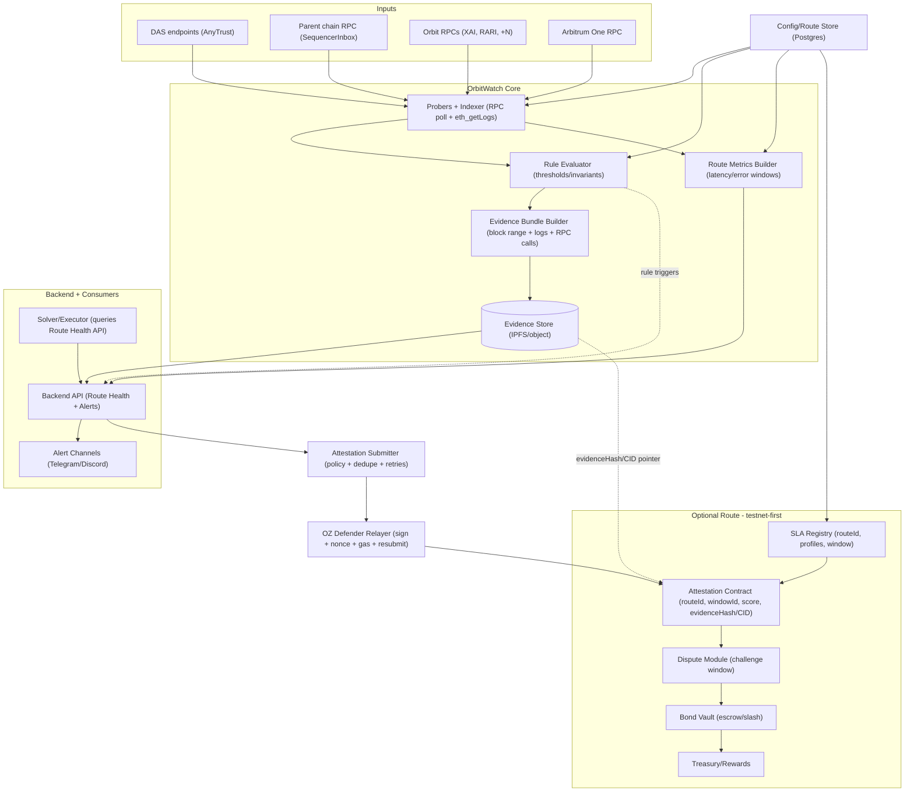

# OrbitWatch Architecture

```mermaid
flowchart TB

%% External inputs
subgraph INPUTS[Inputs]
  DAS["DAS endpoints (AnyTrust)"]
  PARENT["Parent chain RPC (SequencerInbox)"]
  ORBIT["Orbit RPCs (XAI, RARI, +N)"]
  ARB1["Arbitrum One RPC"]
end

CFG["Config/Route Store (Postgres)"]

%% OrbitWatch Core
subgraph CORE[OrbitWatch Core]
  PI["Probers + Indexer (RPC poll + eth_getLogs)"]
  RE["Rule Evaluator (thresholds/invariants)"]
  RMB["Route Metrics Builder (latency/error windows)"]
  EBB["Evidence Bundle Builder (block range + logs + RPC calls)"]
  ESTORE[("Evidence Store (IPFS/object)")]
end

%% Backend + consumers
subgraph APP[Backend + Consumers]
  SOLVER["Solver/Executor (queries Route Health API)"]
  API["Backend API (Route Health + Alerts)"]
  ALERTS["Alert Channels (Telegram/Discord)"]
end

%% Attestation submission
SUB["Attestation Submitter (policy + dedupe + retries)"]
RELAYER["OZ Defender Relayer (sign + nonce + gas + resubmit)"]

%% Optional SLA route
subgraph SLA[Optional Route - testnet-first]
  SLAREG["SLA Registry (routeId, profiles, window)"]
  ATTEST["Attestation Contract (routeId, windowId, score, evidenceHash/CID)"]
  DISPUTE["Dispute Module (challenge window)"]
  BOND["Bond Vault (escrow/slash)"]
  TREASURY["Treasury/Rewards"]
end

%% Wiring: inputs/config -> core
DAS --> PI
PARENT --> PI
ORBIT --> PI
ARB1 --> PI

CFG --> PI
CFG --> RE
CFG --> RMB
CFG --> SLAREG

%% Core internal flow
PI --> RE
PI --> RMB
RE --> EBB
RMB --> API
EBB --> ESTORE
ESTORE --> API

%% Rule triggers / alerting flow
RE -.->|rule triggers| API
API --> ALERTS

%% Solver queries
SOLVER --> API

%% Attestation flow
API --> SUB
SUB --> RELAYER
RELAYER --> ATTEST
ESTORE -.->|evidenceHash/CID pointer| ATTEST

%% Optional SLA contract relationships
SLAREG --> ATTEST
ATTEST --> DISPUTE
DISPUTE --> BOND
BOND --> TREASURY
```
